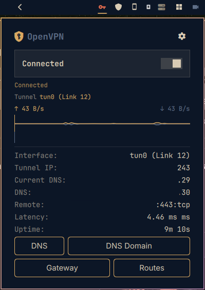

# Omarchy OpenVPN Connect

An [Omarchy](https://omarchy.org) plugin to manage an OpenVPN connection from the
bar: import multiple `.ovpn` profiles, authenticate with username/password **and a
TOTP (MFA) code** via challenge/response, view a real-time traffic graph, and inspect
a network info panel (tunnel IP, interface, gateway, DNS, routes, search domains).

No `sudo` / NOPASSWD is required — the plugin drives NetworkManager (`nmcli`) using
the user's existing PolicyKit privileges. Credentials are passed through the
environment; only the username is persisted to disk, never the password.

## Preview



## Features

- **Multiple profiles** — import several `.ovpn` files, selectable from the config panel.
  Import is idempotent by name: re-importing reuses the existing connection instead of
  creating duplicates.
- **User/pass + TOTP auth** — the server's dynamic challenge (`CRV1`) is handled by
  feeding the password and the raw OTP through `nmcli connection up --ask` on stdin
  (the colon-keyed challenge secret cannot be expressed via a passwd-file). The TOTP
   code is entered at connect time and is never stored.
- **OpenVPN Access Server compatible** — works against OpenVPN Access Server (AS),
  which uses the same `CRV1` dynamic-challenge for username/password + TOTP; the
  password and OTP are fed through `nmcli connection up --ask` exactly as above.
- **Live traffic graph** — up/down throughput (mirrored ↑/↓) across the panel width.
- **Network info** — status, tunnel IP, interface (e.g. `tun0`), gateway, DNS,
  search domains, routes, latency, remote endpoint.
- **Split tunnel** — keep personal traffic on the physical interface (the VPN does not
  become the default route) while professional routes still go through the tunnel.
- **mssfix** — optional `mssfix 1360` for HTTPS/MTU issues.

## Installation

```bash
omarchy plugin add https://github.com/tug-benson/omarchy-openvpn
```

Or symlink during development:

```bash
ln -s /path/to/omarchy-openvpn ~/.config/omarchy/plugins/openvpn
```

To remove:

```bash
omarchy plugin remove io.github.tug-benson.openvpn
```

## Dependencies

```bash
sudo pacman -S networkmanager networkmanager-openvpn openvpn python3 polkit zenity
```

- `networkmanager` / `nmcli` — manages the VPN connection (no root needed).
- `networkmanager-openvpn` — the NetworkManager OpenVPN plugin; **required** so that
  `nmcli connection import type openvpn` can create the VPN connection. Without it the
  import fails (the UI will now report the error instead of failing silently).
- `openvpn` (>= 2.6) — the underlying client launched by NetworkManager.
- `python3` — generates the connection config and gathers traffic/network info.
- `zenity` — file picker for `.ovpn` import.
- `polkit` — grants the user permission to modify NetworkManager connections.

## Usage

1. Click the VPN icon in the bar to open the panel.
2. Click ⚙ to import a `.ovpn`, enter credentials, and enable TOTP if the server asks.
3. Press **Connect**; enter the TOTP code when prompted, then connect.
4. The traffic graph and network info appear once connected.

## How it works

- `bin/omarchy-openvpn-import` copies a `.ovpn` into
  `~/.config/openvpn/profiles` and creates a NetworkManager connection (idempotent by
  name).
- `bin/omarchy-openvpn-connect` applies the chosen port/protocol, mssfix and split-tunnel
  settings, then brings the connection up. For TOTP, the password and the raw OTP are
  piped to `nmcli connection up --ask` on stdin.
- `bin/omarchy-openvpn-disconnect` brings the connection down.
- `bin/omarchy-openvpn-info` reads traffic counters and network details (`ip`,
  `resolvectl`, `nmcli`) for the active tunnel device and returns them as JSON.
- `bin/omarchy-openvpn-status` reports the connection state.
- `bin/omarchy-openvpn-config` stores non-secret settings (selected profile, username,
  TOTP/mssfix/split flags); the password is never written to disk.

## Layout

```
omarchy-openvpn/
├── manifest.json
├── BarWidget.qml        # bar icon + panel host
├── Panel.qml            # panel: title, Connect/Disconnect, graph, info, TOTP prompt
├── ConfigPanel.qml      # profile import, credentials, TOTP, split tunnel, mssfix
├── Service.qml          # shared state, polling, connect/disconnect
├── Sparkline.qml        # traffic graph (adapted from harshith.system-monitor, MIT)
└── bin/
    ├── omarchy-openvpn-status      # connection state (JSON)
    ├── omarchy-openvpn-info        # network info + traffic counters (JSON)
    ├── omarchy-openvpn-profiles    # list imported profiles
    ├── omarchy-openvpn-import      # copy a .ovpn into ~/.config/openvpn/profiles
    ├── omarchy-openvpn-remote      # extract the remote endpoint
    ├── omarchy-openvpn-static-challenge  # detect a forced static-challenge
    ├── omarchy-openvpn-config      # non-secret settings (profile, TOTP, etc.)
    ├── omarchy-openvpn-connect     # bring the connection up (handles TOTP)
    └── omarchy-openvpn-disconnect  # bring the connection down
```

## License

MIT
